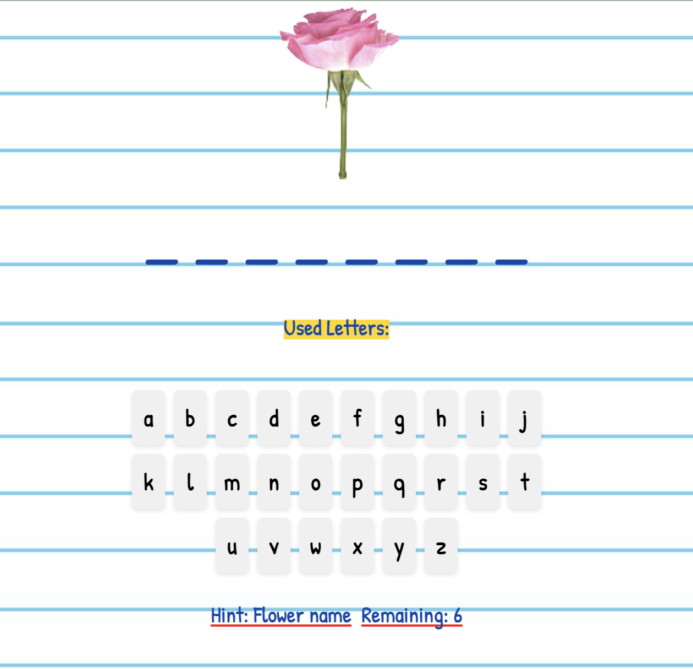

# Guess the Word Game 🌹

The Guess the Word is a word guessing game where players try to guess the names of different flower types. The game features a paper and writing-style interface with a visual representation of a rose flower that changes as the game progresses.

## Game Rules

1. At the start of the game, a random flower name is chosen from a predefined list.
2. The player's goal is to guess the flower name by selecting letters one by one.
3. Each correct guess reveals the corresponding letter(s) in the flower name.
4. Each incorrect guess leads to the rose flower dying.
5. The game ends when the player guesses the correct word or when the rose flower dies.
6. The player can choose to play again after the game ends.

## Technologies Used

- React: A JavaScript library for building user interfaces.
- CSS: Styling the game interface.
- Images: Utilised for the visual representation of the rose flower.

## Live Demo

Try the live demo of the Guss the Word game: [Demo](http://anya.works/guess-the-word)

## Installation

1. Clone the repository: `git clone https://github.com/anyapages/guess-the-word.git`
2. Navigate to the project directory: `cd guess-the-word`
3. Install the dependencies: `npm install`
4. Start the development server: `npm start`
5. Open the game in your web browser: `http://localhost:3000`

## Screenshots

## License

This project is licensed under the [MIT License](LICENSE).

## Author

Anya 
